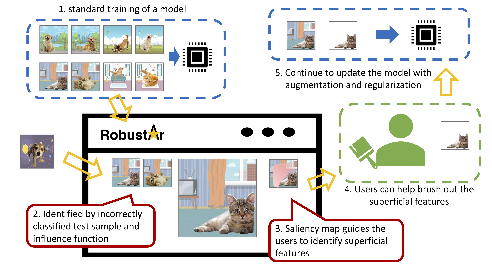

# Robustar
Interactive Toolbox for Pricise Data Annotation and Robust Vision Learning

This repository is for end users. For source code, please visit our [source code repository](https://github.com/HaohanWang/Robustar_implementation). 

### Main Use Case (Workflow): 

1.	the model can be trained elsewhere and then fed into the software; 
2.	With new test samples, the model can help identify the samples that are responsible for the prediction through influence function; 
3.	the software offers saliency map to help the user know which part of the features the model are paying necessary attention; 
4.	the users can use the drawing tools to brush out the superficial pixels; 
5.	new annotation of these images will serve as the role as augmented images for continued training.

### Video Summary (click to watch the video)

### Installation 

- To install Robustar, please first [intall Docker](https://docs.docker.com/engine/install/) locally. If you wish to use GPU, please install a few more dependencies with`install-nvidia-toolkit.sh` .
- Then, one can start the robustar with [robustar.sh](https://github.com/HaohanWang/Robustar/blob/main/robustar.sh?raw=1) included in this repository.  You may need to use `sudo` if you are on UNIX systems, or open run a terminal as system admin on Windows.

  - First time users please run `./robustar.sh -m setup -a <version>` to pull docker image. Please visit our [DockerHub page](https://hub.docker.com/repository/docker/paulcccccch/robustar) for a complete list of versions.
  - One can run `./robustar.sh -m run <options>` to start robustar. Please read the next section for detailed options. You can also refer to `example.sh` for sample running configurations.

- Directly run `./robustar.sh` will display the help message. 

  
<b>Click to Expand Built-in Help Message</b>

  > Help documentation for robustar.
> 
> Basic usage: robustar -m [command] [options]
> 
> [command] can be one of the following: setup, run.
> 
> setup will prepare and pull the docker image, and create a new container for it.
> 
> run will start to run the system.
> 
> Command line switches [options] are optional. The following switches are recognized.  
> -p  --Sets the value for the port docker forwards to. Default is 8000.  
> -a  --Sets the value for the tag of the image. Default is latest.  
> -n  --Sets the value for the name of the docker container. Default is robustar.  
> -t  --Sets the path of training images folder. Currently only supports the PyTorch DataLoader folder structure as following  
> -----images/  
> ----------dogs/  
> ---------------1.png  
> ---------------2.png  
> ----------cats/  
> ---------------adc.png  
> ---------------eqx.png  
> -e  --Sets the path of testing images folder. Currently only supports the PyTorch DataLoader folder structure  
> -i  --Sets the path of the calculation result of the influence function.  
> -c  --Sets the path of model check points folder.  
> -o  --Sets the path of configuration file. Default is configs.json.  
> -h  --Displays this help message. No further functions are performed.  

### Contributing

Please visit our [source code repository](https://github.com/HaohanWang/Robustar_implementation). 

Also, feel free to check out our [Trello board](https://trello.com/b/7xCpD30K/robustar) to stay tuned for our latest updates!

### Disclaimer

Robustar has finally released v0.0.1-beta! :sparkles:

While we are grateful that the community is interested in using our system, please bear with us that some functions are still in inchoate forms. 

We are welcoming feedbacks of all kinds! 

### Contact  (names listed alphabetically)

[Chonghan Chen](https://github.com/PaulCCCCCCH)
&middot; 
[Haohan Wang](http://www.cs.cmu.edu/~haohanw/) 
&middot; 
[Leyang Hu](mailto:leonleyanghu@gmail.com)
&middot; 
[Linjing Sun](https://github.com/scyls)
&middot; 
[Yuhao Zhang](mailto:yhao.zhang98@gmail.com)

