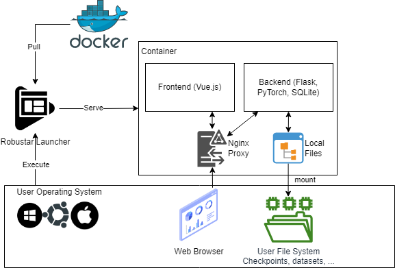

# Developer Guide

We will go through the implementation details for Robustar. For environment setup issues, please follow the [frontend setup guide](https://github.com/HaohanWang/Robustar_implementation/blob/main/front-end/README.md) and [backend setup guide](https://github.com/HaohanWang/Robustar_implementation/blob/main/back-end/README.md) in our repository.

## Robustar Architecture

Robustar's architecture is shown below.

Robustar is developed as a Web application wrapped in a docker image. We use Web stack mainly because of the following reasons:

- With Web GUI, we don't need to worry about cross platform issues.
- There is more abundant resources for developing good visual components with Web. 
- With a separate frontend and backend, it is easier to refactor Robustar if we want to deploy it on the cloud in a SaaS manner in the future.

For now, users will need to pull the docker image and host the frontend and backend on their own machines. However, we hide the docker layer away with a launcher. They can simply download the launcher, click a few buttons on the GUI, and then use a browser to use Robustar. The launcher is implemented in Python with `pyside2` (something similar to `PyQT`). It can be compiled for multiple systems. We will talk about the launcher later.

 

## The Frontend

Here is a list of the main stack we used for the frontend.

| Library / Tool               | Usage                           |
| ---------------------------- | ------------------------------- |
| HTML/CSS, JavaScript, Vue.js | Web basics & frontend framework |
| Lerna                        | Monorepo management             |
| Vuetify                      | Visual component library        |
| eslint & prettier            | Code Styling                    |
| Axios                        | API client                      |
| Cypress                      | Unit tests & end-to-end tests   |

Besides, we adopted [`tui-image-editor`](https://ui.toast.com/tui-image-editor) to suit our image annotation needs and placed it in our repository. Thus, we have two separate packages for the frontend: `image-editor` package for `tui-image-editor` and `robustar` for the main frontend. `robustar` package relies on `image-editor`, and this is managed by `lerna`.

The main Robustar interface is in `/front-end/packages/robustar/src`. These are the most important folders:

- `views/`: Each file corresponds to a page that can be accessed with a different URL. 
- `components/`: Stores visual components, for example, model visualizers, that can be used in multiple pages.
- `services/`: Stores all API call utilities.

For `tui-image-editor`, please visit [their GitHub page](https://github.com/nhn/tui.image-editor).

## The Backend 

Here are the main backend libraries we used:

| Library / Tool                     | Usage                               |
| ---------------------------------- | ----------------------------------- |
| Flask                              | API server in Python                |
| python-socketio                    | Socket connection utility           |
| SQLite                             | Database                            |
| Flashtorch                         | Model saliency map visualization    |
| pytorch_influence_functions        | Influence function calculation      |
| Pillow                             | Python's image library              |
| PyTorch, torchvision, numpy, scipy | Machine learning pipeline utilities |
| Tensorboard                        | Model training visualization        |
| pytest                             | Unit test                           |

The backend is organized as follows:

- `apis/`:  All API endpoint definitions
- `ml/`: All code related to the machine learning pipeline (e.g., dataset definition, influence calculation, trainer initialization, ...)
- `modules/`: Independent modules (usually code adopted from other places)
  - `bg_remove/`: For auto-removing the background of images with a image segmentation model
  - `influence_module/`: For influence function calculations
  - `visualize_module`: For saliency map visualization (with `flashtorch`)  
- `objects/`: All important Python Classes
  - `RAutoAnnotator`:  A wrapper for image segmentation model for background removal
  - `RDataManager`: Represents the entire dataset (all splits + paired data).  A aggregation of `RImageFolders`.
  - `RImageFolder`: Represents a data split. Supports data manipulation and interacts with the SQLite database.
  - `RModelWrapper`: A wrapper for models that the user is training / interacting with.
  - `RServer`: Represents the entire server instance. Stores useful global information.
  - `RTask`: Represents a task (e.g., model training, batch auto-annotation, testing...), which usually takes some time to finish. Can be started / updated / stopped.
-  `utils/`: Implementation of APIs.
- `tests/`: Test cases.

### Backend File System Interaction

The backend will read from / write to the local storage inside the container. Specifically:

- It will initialize a `SQLite` database if it does not exist. All metadata will be stored in the database. These include:
  - All data records
  - All visualization records
  - All influence records
  - All correctly/incorrectly classified samples 
- It will save model's checkpoint.
- It will save the images annotated by the user.
- It will save any pre-calculated results, such as visualization images and background removal proposals.

When starting the container with a launcher, users can mount these files from their file system into the container, so that any changes will be reflected in their file system. Inside the container, the backend will access these files with hard coded paths, which are available in `RServer` object.

## CI/CD & Tests

Backend tests are available in `back-end/tests`. Frontend tests are available in `front-end/cypress/tests/components`. Refer to frontend and backend setup guide in our repo to run these tests locally.

We use `CircleCI` to perform `CI/CD` tasks. The configuration can be found in `.circleci/config.yml`. We do the following in the pipeline

- Pull code from GitHub
- Download dependencies and dev dataset
- Run all test cases
- Build docker image
- Push docker image to DockerHub

If the commit is made to the main branch, we will trigger a release build, which has a tag of the format `x.y.z`. Otherwise, when the any commit is pushed to other branches, we trigger a dev build with tag `x.y.<commit_hash>`.

## Docker

We build a docker image in two steps. First, we will build a base image with `/docker-base/DOCKERFILE`, which will include all necessary libraries and tools ready, except for everything related to PyTorch. Then, based on the base image, we then build the full image with `/DOCKERFILE`. Note that we can supply an argument specifying the `CUDA` version to build for, and the script `/scripts/install_pytorch.sh` will install the corresponding version.

## Launcher